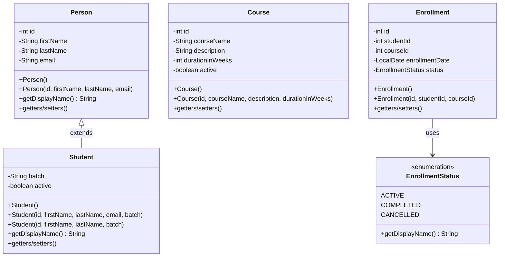
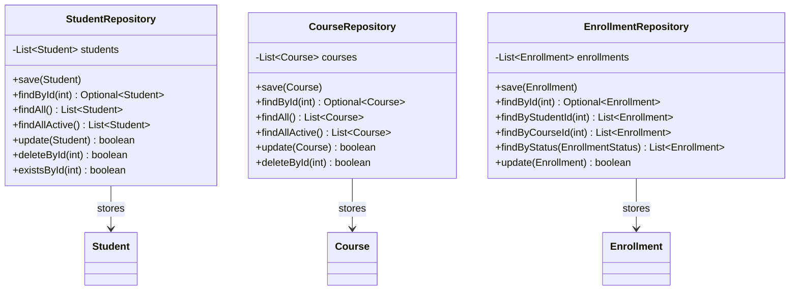
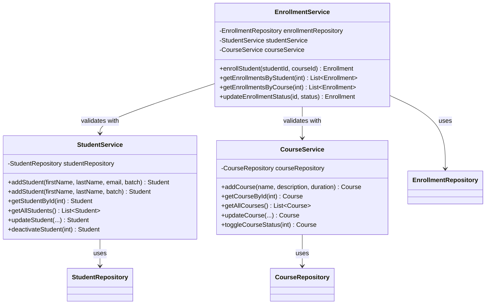
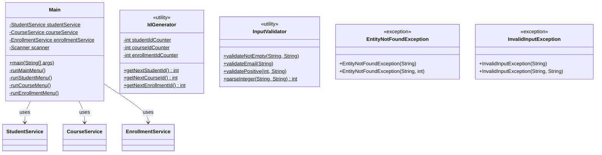
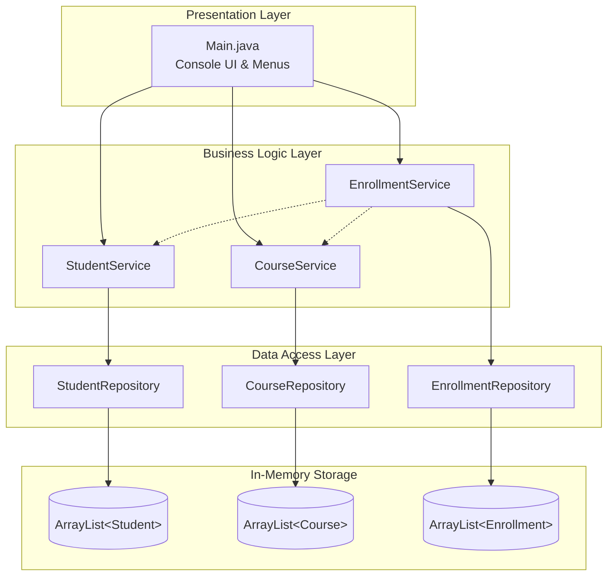

# LearnTrack - Student & Course Management System

LearnTrack is a console-based Student & Course Management System built using Core Java. It allows administrators to manage students, courses, and enrollments through an interactive menu-driven interface.

## Features

- **Student Management**: Add, view, search, update, and deactivate students
- **Course Management**: Add, view, search, update, and toggle course status
- **Enrollment Management**: Enroll students in courses, view enrollments, update enrollment status

## Class Diagram

### Entity Classes



### Repository Layer



### Service Layer



### Application Architecture



### Complete System Overview



## Project Structure

```
src/
└── com/
    └── airtribe/
        └── learntrack/
            ├── Main.java                    # Menu & application entry point
            ├── entity/                      # Data models
            │   ├── Person.java
            │   ├── Student.java
            │   ├── Course.java
            │   └── Enrollment.java
            ├── repository/                  # Data storage layer (in-memory)
            │   ├── StudentRepository.java
            │   ├── CourseRepository.java
            │   └── EnrollmentRepository.java
            ├── service/                     # Business logic layer
            │   ├── StudentService.java
            │   ├── CourseService.java
            │   └── EnrollmentService.java
            ├── exception/                   # Custom exceptions
            │   ├── EntityNotFoundException.java
            │   └── InvalidInputException.java
            ├── util/                        # Utility classes
            │   ├── IdGenerator.java
            │   └── InputValidator.java
            ├── constants/                   # Application constants
            │   ├── MenuOptions.java
            │   └── AppConstants.java
            └── enums/                       # Enumerations
                └── EnrollmentStatus.java
```

## Prerequisites

- Java Development Kit (JDK) 17 or higher
- Any Java IDE (IntelliJ IDEA, Eclipse, VS Code) or command line

## How to Compile and Run

### Using Command Line

1. Navigate to the project root directory:
   ```bash
   cd LearnTrack
   ```

2. Compile all Java files:
   ```bash
   mkdir -p out
   javac -d out $(find src -name "*.java")
   ```

3. Run the application:
   ```bash
   java -cp out com.airtribe.learntrack.Main
   ```

### Using an IDE

1. Open the `LearnTrack` folder as a project in your IDE
2. Set `src` as the source root
3. Run `Main.java`

## Usage

When you run the application, you'll see a main menu with the following options:

1. **Student Management** - Manage student records
2. **Course Management** - Manage course offerings
3. **Enrollment Management** - Manage student enrollments in courses
0. **Exit** - Exit the application

Each submenu provides specific operations for that entity type.

## OOP Concepts Demonstrated

| Concept | Implementation |
|---------|----------------|
| **Encapsulation** | Private fields with public getters/setters in entity classes |
| **Inheritance** | `Student` extends `Person` base class |
| **Polymorphism** | Method overriding (`getDisplayName()` in Student) |
| **Constructor Overloading** | Multiple constructors in entity and service classes |
| **Static Members** | `IdGenerator` utility class with static counters and methods |

## Technologies Used

- Core Java (JDK 17+)
- Collections Framework (ArrayList)
- Java Time API (LocalDate)
- Exception Handling

## Documentation

See the `docs/` folder for additional documentation:
- `Setup_Instructions.md` - Detailed setup guide
- `JVM_Basics.md` - Understanding JDK, JRE, and JVM
- `Design_Notes.md` - Design decisions and architecture notes

## Author

Rahul Vishwakarma
